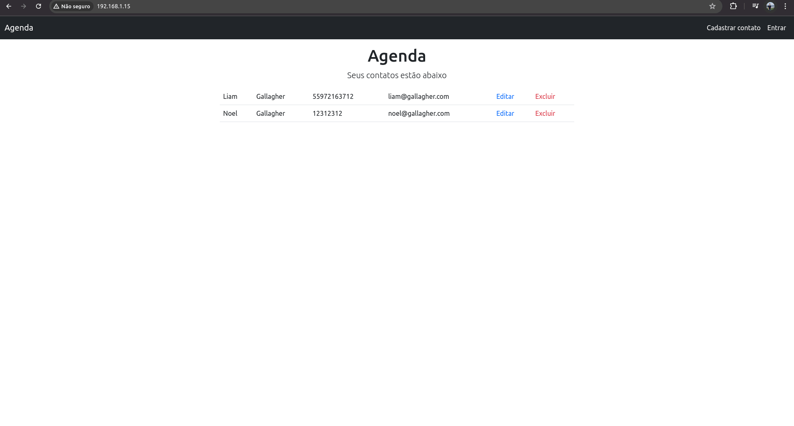

# Projeto de agenda pessoal

Projeto de agenda pessoal construído no curso de Javascript e TypeScript - front-end e back-end (Full Stack) - Node, Express, noSQL, React, hooks, Redux e Design Patterns.

## Tecnologias praticadas neste projeto

- EJS;
- Bootstrap;
- Node.js;
- Webpack;
- Express;
- MongoDB;
- PM2;
- Nginx.

## Funcionalidades do projeto

- Cadastro e login de usuários;
- Cadastro, visualização, atualização e exclusão de contatos na agenda.

### Gif do projeto

